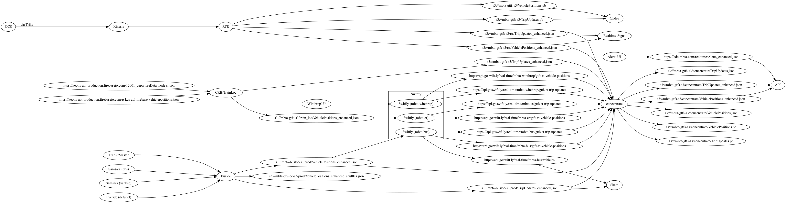
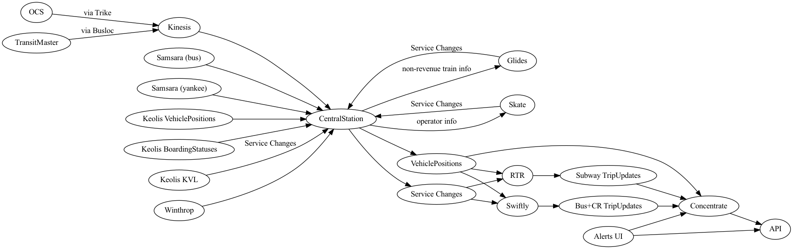

- Feature Name: central_station
- Start Date: 2022-03-07
- RFC PR: [mbta/technology-docs#0000](https://github.com/mbta/technology-docs/pull/0000)
- Asana task: [asana link](https://app.asana.com/)
- Status: Proposed

# Summary

[summary]: #summary

"CentralStation" (aka "Superloc", but official name TBD) is an application that manages all of the
MBTA's realtime data across modes. This application will combine the responsibilities of parts of
Busloc, parts of RTR, all of CRB and Trainloc, evenutally obviate Concentrate and Realtime
Dashboard, and be the API that Keolis, Glides, and Skate uses for Service Changes. It will be the
canonical source of all realtime data that CTD deals with, public and private, will publish the
standard, public data as GTFS-rt and provide API's to internal apps for manipulating data or
retrieving non-public and non-standard data.

Current realtime data ecosystem:

Proposed realtime data ecosystem:

# Motivation

[motivation]: #motivation

As was brought to light in the TRC team structure iteration plan, realtime data has until now been
scattered across various apps, and passed around via standard and non-standard GTFS-esque files.
With a renewed focus on the realtime data, and one team to manage it, it makes sense to
consolidate the data into one app as well.

This will help in the coming months with a series of related feature requests across apps and
modes: generally the idea of "service changes", which will be coming from Skate, Keolis, and
Glides.

In addition, centralizing the majority of our work into one app will have benefits in terms of
keeping the infrastructure, software dependencies, and team knowledge up to date, as well as with
onboarding new team members.

# Guide-level explanation

[guide-level-explanation]: #guide-level-explanation

CentralStation is the app that centralizes all the realtime vehicle data and is the canonical
source of that data for CTD apps and our public feeds. Data is at the core of CTD, and where are
vehicles are and what they're doing underlies all of that. It deserves to be centralized, easily
accessed and queried, and valid and referentially sound by construction. The question of what trip
a vehicle is on is rightly the domain of the MBTA, and shouldn't be left to Swiftly, a 3rd party,
to determine.

In contrast to the previous status quo, where several apps contribute complete or partial
GTFS-rt-esque blobs of data, aggregated by Concentrate into the public feed which mostly served as
the canonical source of MBTA data, the source of the data will be internally managed by
CentralStation, probably in a relational database, and the GTFS-rt outputs will simply be a
periodic serialization of its public data. Apps that require non-public data or data that doesn't
fit the spec can get it from CentralStation via an API.

CentralStation is a Phoenix application (given its API), and there are admin pages for developers
and superusers to easily inspect the state of the application, its data feeds, and the data
itself.

In GTFS terms, CentralStation will be roughly the store of VehiclePositions and the
upcoming-and-forever-debated Service Changes. Depending how this works for us (I foresee having
our data in one place, in a relational database, as a web app being a force multiplier), we might
extend it to be the canonical store of alerts and predictions as well. A longer term possibility
is for it to manage some aspects of static GTFS as well (Arrow reincarnated?), given its tight
coupling to realtime data.

CentralStation receives the raw vehicle movement data from a variety of sources, to keep track of
what vehicles in the system are operating and where. Internally, it manages both revenue and
non-revenue vehicles.

One of the most important functions of CentralStation is "tagging", that is matching vehicles to
the GTFS trip they're on. It does this by considering the vehicle's position, metadata we've
received about the vehicle (for instance the internal OCS trip ID for heavy rail vehicles, the
GTFS short name for CR vehicles, or the GTFS Trip ID for buses), and other heuristics. The
business logic could be as advanced as keeping track of runs or blocks, identifying when a vehicle
is at the final terminal, and so on. In addition, in the cases when we get this wrong,
CentralStation receives API events from KVL, Glides, and Skate, updating the tag.

Furthermore, CentralStation manages the "Service Changes" to trips. If Keolis, Glides, or Skate
updates CentralStation that a new trip is being created, a trip is being canceled, or the trip's
properties (stops, shape, headsign, etc) are being changed, CentralStation stores this information
and uses it to produce GTFS ServiceChanges files. Swiftly and RTR statelessly consume these
VehiclePositions and ServiceChanges to produce predictions. (This relies on us using our combined
mode leverage and Swiftly's stated interest in consuming a feed like this; currently they only
offer a proprietary API. If they don't get around to consuming a feed, CentralStation will instead
use their API, tying us to Swiftly, but only at the CentralStation boundary, and not at Glides,
Skate, Keolis levels.)

CentralStation periodically produces the public GTFS VehiclePositions feed consumed by
concentrate, by selecting its revenue vehicles and public fields. In the future, it may produce
the Alerts and TripUpdates fields, too, using Swiftly and/or RTR and/or TransitClock as
implementation details, and applying alerts and other business logic on top. But for now, we lean
on the existing alert-applying logic in concentrate, and expect RTR and Swiftly to provide the
TripUpdates to concentrate.

If internal CTD apps need data not in the public feed, they can access it via CentralStation's
API. For example, Glides will use CentralStation to access all the non-revenue vehicles, and Skate
can get block and run information. (And operator info, like name? I don't know if PI info like
that needs to live in CentralStation.)

# Reference-level explanation

[reference-level-explanation]: #reference-level-explanation

Here are the effects of this proposal on the various pieces of our current realtime data
ecosystem, starting with the idea of Service Changes, then all our existing apps, and finally
CentralStation itself.

## Service Changes

A major component of this proposal, and a strong focus of CTD going forward, is the idea of
"Service Changes". This is a [GTFS-rt proposal that has been discussed for 3.5
years](https://github.com/google/transit/issues/113). Here is the [most recent version of the
proposal](https://docs.google.com/document/d/1oPfQ6Xvui0g3xiy1pNiyu5cWFLhvrTVyvYsMVKGyGWM/edit#heading=h.mm6bblup6h8d).
I refer to these in the RFC as a "ServiceChanges" file, but really the proposal is about new
FeedEntity enum values, as well as extending the existing TripUpdates one. By convention, we
produce `VehiclePositions` and `TripUpdates` files separately, though this is not required by the
spec. We could similarly produce a `ServiceChanges` file composed of feed entities related to
service changes.

Swiftly has implemented some of it, in spirit, via its [Service
Adjustments](https://www.goswift.ly/blog/introducing-service-adjustments) feature. Swiftly
currently only supports creating these via a proprietary
[API](https://swiftly-inc.stoplight.io/docs/service-adjustments/b3A6Mjg0MzkyMzY-create-adjustment)).

The main thrust of it all is a way to update GTFS trips in real-time more comprehensively. Current
TripUpdates can make predictions against existing trips, and can indicate that a train will skip a
stop, but it can't indicate that the trip will go to a different stop, or provide a shape for that
new route, or update properties of the trip like its headsign, limiting our ability to provide
data for unplanned disruptions. In addition, Service Changes allow us a
soon-to-hopefully-be-standardized way to communicate known trip changes to prediction providers,
for example dispatchers planning to hold a vehicle at a station.

Swiftly, at our last quarterly check-in, said they were open to the idea of consuming a feed like
this, as opposed to using their API. My hope is that if we move forward with this, that will
motivate Swiftly to implement it. And with the MBTA producing these for all its modes and Swiftly
consuming them that might be the push to finally get Service Changes officially accepted.

## RTR

### Current description

RTR provides the realtime data for the heavy rail and light rail routes (together: "subway"). It
receives data from the OCC via Kinesis events. The events are for the following data:

- Light rail (Green Line and Mattapan) train movements
  - Track circuits mostly downtown
  - GPS from the onboard rocket routers, matched into "geofences" which were manually created
  - AVIs that the trains pass.
- Heavy rail (Red, Orange, and Blue)
  - Track circuits only
- Scheduling information (heavy rail only) ("trainsheets")
  - Which trip the train is on. These are internal IDs, and not GTFS trips.
  - What the subsequent trip is.
  - Terminal departure times of trips, with dispatcher-entered "offsets" in minutes
- "Device" information, like state of switches and terminal bells, and hold lights
  - We mostly don't use any of this.

RTR uses this raw data to keep track of where the known subway vehicles are. It attempts to match
current revenue OCS trips to a plausible GTFS trip, creating an "ADDED" trip if none match. It
publishes this data as VehiclePositions.

RTR also generates predictions for most revenue vehicles' current trips and some subsequent trips.
It publishes this data as TripUpdates. Unmatched GTFS trips it publishes as CANCELED.

In the future, we may get raw GPS updates from all light rail vehicles once every 5 seconds, both
in and out of revenue service.

The RTR data is GTFS-rt-esque; The TripUpdates also includes our "boarding_status" extension for,
e.g., "Stopped 4 stops away" for Realtime Signs, a passthrough_time field for non-revenue trains
for Realtime Signs to play the "please stand back from the yellow line" message, route_pattern_id
for ADDED trips. The VehiclePositions include "consist" information.

Realtime Signs consumes the RTR `_enhanced.json` directly, rather than via the public API for
those extra fields above. Glides consumes it directly, and would ideally like the VehiclePositions
of all light rail trains, in service or not.

### With CentralStation

RTR will change to behave more like how we want Swiftly to behave.

It will consume VehiclePositions data from CentralStation, and importantly, those vehicle
positions will have a GTFS trip tagged. This will simplify RTR as a large part of the message
handling logic is about deciding what trip a vehicle is on.

It will also consume the ServiceChanges feed, which is how CentralStation will convey the TSCH
offsets it receives.

As a bonus, by relying on GTFS trips and ServiceChanges, RTR won't have to rely on handcrafted
patterns, and should be able to predict, e.g., new stations or closed stations automatically.

Question: how do you make reverse predictions this way? Is there something in this data model that
allows us to convey to RTR the _subsequent_ trip for a vehicle?

## Busloc

### Current description

Busloc primarily keeps track of the whereabouts of MBTA buses and publishes a few feeds related to
them. Busloc runs on the MBTA network because one of the sources of its data, the TransitMaster
DB, is only accessible from there.

The majority of what Busloc deals with is "normal" bus data. These are buses logged on and running
their expected, planned routes. Busloc gets this data from TransitMaster, via its hacky internal
spelunking of the TransitMaster DB, and via Samsara, a cloud service that has more frequent GPS
updates. Busloc combines these feeds, taking the latest lat/long from either source for every
vehicle. These logged-on vehicles have their GTFS trip directly in the data, since TransitMaster
and GTFS both get their source data from HASTUS. The Samsara data doesn't _have_ to be queried
from the MBTA network, but is done to have all the data in one place and for simplicity merging
with the TransitMaster data. This data is published as VehiclePositions, which is consumed by
Swiftly to generate TripUpdates. The data is GTFS-rt-esque, but includes block and run data, which
Swiftly takes advantage of.

In addition to the planned service, TransitMaster also has "overload" trips, which is when a bus
is assigned to run a route that it wasn't planned for. These create "ADDED" trips, based on a
scheduled trip but with an offset at every location. Since Swiftly cannot produce predictions for
non-GTFS trips (is this still true?), Busloc marks these with a special "unassigned" status,
preventing Swiftly from incorrectly matching them to a GTFS trip. TransitMaster also generates
predictions (of unknown quality, or perhaps simply the arrival/departure values from the
underlying trip + offset), and these are published in a TripUpdates file which concentrate
consumes directly.

Conversely, "block waivers", when trips are canceled, are also handled by Busloc and also bypass
Swiftly. Busloc receives the list of waivers via TransitMaster and publishes them as a special
TripUpdates file, marking their stops as "SKIPPED". Swiftly is meanwhile publishing predictions
for the canceled trips because the VehiclePositions are in the feed, and Swiftly can't handle
waivers. So concentrate merges the Swiftly TripUpdates and the special Busloc TripUpdates feed and
cancels the trips there. (Is that correct?)

Lastly, Busloc has another Samsara feed from Yankee, which includes the VehiclePositions of
shuttle buses. Those are output more or less as-is, and we don't try to make predictions for them.
(Do these end up in concentrate? I didn't see them. I can't tell where
VehiclePositions_enhanced_shuttles.json goes.)

In addition to the standard VehiclePositions and TripUpdates data, Busloc publishes operator data
(e.g. the name of the person driving the bus) from TransitMaster, for Skate to consume. I believe
this data is passed along in one of the TripUpdates files (?), and stripped out later in the
process by concentrate.

### With CentralStation

Busloc will be pared down to something more Trike-esque. Since on-premise Windows servers are so
hard to deal with, the smaller Busloc is the better. It will continue to handle the TransitMaster
integration, but it will put this data into Kinesis for CentralStation to consume.

The Samsara feeds will be removed, as those will go directly to CentralStation.

## Trainloc / CommuterRailBoarding

### Current description

TrainLoc and CommuterRailBoarding are two applications that once were separate but were
consolidated into a single umbrella application, using the name Commuter Rail Boarding, and they
manage the realtime data of commuter rail trains from Keolis.

Keolis offers two firebase feeds, consumed by CRB:

- The "boarding status" feed, which we get for trains at a few stations, with info like "now
  boarding on track 9". We put these in TripUpdates_enhanced.json, in our extension
  `boarding_status` field. Concentrate generally merges these with predictions for the trains, but
  we often end up with StopTimeUpdates with null arrivals and departures.
- The vehicle positions feed. We get updates every ~15 seconds with the position of every commuter
  rail train. If the AVL equipment is working and the train is logged in, it includes the GTFS
  trip short name. Otherwise we get lat/long and a vehicle ID, but not the trip.

The VehiclePositions are consumed by Swiftly to produce our predictions. The trains without a trip
short name get auto-assigned a GTFS trip by Swiftly, and Keolis customer service people log into
the Swiftly dashboard to manually re-tag trains that have been given an incorrect assignment.

### With CentralStation

The vehicle positions feed will go straight to CentralStation. At least initially, the boarding
status feed will continue to be handled by CRB and continue to go to concentrate as TripUpdates.
In other words CRB will become CRB again, and drop TrainLoc entirely.

## Glides

### Current description

Right now Glides is just a consumer of the realtime data, directly from RTR.

### With CentralStation

Glides will either get all its data from CentralStation, or get the public data from our public
feeds, and supplement it with private data from CentralStation.

It will use CentralStation's API for train tagging and service changes.

## Skate

### Current description

Skate consumes bus realtime data, straight from Busloc. This data is GTFS-rt-esque, enriched with
operator information and block and run data.

### With CentralStation

Skate will get all its vehicle position data from public feeds. It will supplement it with private
data from CentralStation.

Depending on if we want CentralStation to store PI operator data, it may continue to get that
information from an S3 file produced by Busloc.

It will use CentralStation's API for train tagging and service changes.

## Concentrate

### Current description

Concentrate is an open source utility app that combines GTFS-rt files. It's not particularly MBTA
specific, though I'm not aware of any other transit agency using it.

In addition to simply merging feeds from different modes, it has logic to process the data by
doing things like dropping vehicles that don't have a trip ID, or merging in alert data to update
trip predictions appropriately.

### With CentralStation

Nothing will change immediately. However, more of its logic may move into CentralStation, like
canceling trips. Longer term, we may even move alerts and predictions into CentralStation,
obviating concentrate entirely.

## Alerts-UI

### Current description

Alerts-UI is the interface that PIOs, bus dispatchers, and Keolis use to manage alerts in the
system. It has an API that gets cached by our CDN, and the CDN endpoint is what is polled by
concentrate, APIv3, and others.

### With CentralStation

Nothing is expected to change.

## API

### Current description

Mostly a wrapper of our public GTFS and GTFS-rt data.

### With CentralStation

Nothing is expected to change.

## CentralStation

And now we come to CentralStation itself. It will be a standard RDS-backed Elixir/Phoenix web app,
running in AWS. It consumes various data feeds itself:

- The Keolis AVL firebase feed
- The OCS messages via Kinesis
- The Samsara feeds for bus positions
- The Busloc data via Kinesis

It loads GTFS static data upon start-up, and periodically checks for updates.

With each update from one of the vehicle position feeds, it updates its internal knowledge of the
VehiclePosition. It maintains taggings of vehicles to trips, and can update that in a variety of
ways:

- For subway heavy rail: TSCH messages
- For Buses: new trip IDs from Busloc
- For CR: new GTFS short names from firebase
- All modes: a vehicle completing its trip
- All modes: a vehicle deviating too far from its trip

It maintains internal state about known service changes, from a variety of sources:

- API requests from Glides, Skate, Keolis KVL
- TSCH messages from the OCC
- Busloc waivers and other data

It periodically processes its public vehicles to produce GTFS-rt files for concentrate.

# Drawbacks

[drawbacks]: #drawbacks

The main drawbacks are: size and cost. This is a big project. It's meant to become the central
source of realtime data for CTD, so will require a lot of resources, and will need to be robust
and performant.

The status quo works for now, and there's a path forward from here to accommodate Service Changes,
as detailed in the alternatives section.

While conceptually it makes sense to think of "realtime data" as a single coherent concept, the
adapters, and the extra data, and the business logic, do vary quite a bit by mode. I expect,
though, that having it in one place will make it easier to work with. If it's in a DB, then the
centralized schema will allow the apps to reuse models, datatypes, queries, and helper functions.
Some commonalities like serializing into GTFS-rt or enhanced JSON files will only need to be
implemented once.

# Rationale and alternatives

[rationale-and-alternatives]: #rationale-and-alternatives

## Why is this design the best in the space of possible designs?

Centralizing the data in a "flagship" application gives us the control over the data that it
deserves. We, as the MBTA, should maintain the canonical mapping of vehicles to the trips that
they're running, not Swiftly. And we should build out tooling for operators and other people at
the MBTA to view and work with that data.

And by keeping all the data in one application, visualization and debugging tools - which, as this
data being the core of CTD, we should invest in - will naturally apply across all modes.

Lastly, this is a response to staffing constraints. It is easier to keep one application, even a
sprawling application that does many things, up to date in terms of CI, dependencies, and
infrastructure. The more we can move day-to-day development into one application, the easier it is
for developers to maintain a working knowledge of the codebase, and the easier it is to onboard
new developers. Using a DB as the primary datastore should be easier for new developers, since
most are accustomed to working with DBs.

## What other designs have been considered and what is the rationale for not choosing them?

The biggest alternative is to build on the status quo. Currently, all the modes work tolerably, if
separately. Service Changes can be accommodated by Skate, Glides, and Keolis separately. We can
lean on Swiftly for vehicle tagging.

One downside of this is it locks us much more tightly into Swiftly. If we rely on Swiftly for
tagging, and have several apps all using Swiftly's API, then we are tightly coupled to them,
making it hard to move off them in the future (if our TransitClock experiments prove fruitful), or
giving them leverage to raise prices quite a bit (like Google did with Maps). If Swiftly does a
poor job of tagging vehicles, we have no recourse.

If Swiftly moves quickly on ingesting ServiceChanges data rather than its API, then the coupling
is a bit less here, but if they don't, and only enable it later on, we may have a variety of apps
that will all need to switch from the API to ServiceChanges approach.

Developers will continue to have to maintain working knowledge of, and actively build on and
debug, a variety of similar yet different applications.

Another alternative is a scaled-down CentralStation. It could be the centralized interface for
Glides, Skate, and Keolis to post Service Changes, but not maintain the state of vehicles itself.
This helps somewhat with the Swiftly coupling, but without having the vehicle and trip state, it
can't validate the requests, or perhaps easily know when one has expired. It also doesn't support
vehicle tagging, which is a major part of what these tools will do.

## What is the impact of not doing this?

The impact of not making a change here is that things will continue on under the status quo.
Glides, Skate, and Keolis will soon be faced with making their changes, and will do so
independently.

Developers may feel burnt out working on lots of different apps.

CTD and the MBTA may not have the best handle on our realtime data.

# Prior art

[prior-art]: #prior-art

WMATA is an example of a transit agency that has a centralized web-app powering a lot of its real
time information. In a demo given to Jessie, Eddie, and me about single tracking, they pulled up a
web page which showed the realtime position of various trains, as well as the state of switches.
In the demo they used the web interface to manually indicate that a switch had changed, indicating
single tracking, and showed how that affected predictions and signs downstream.

Regarding the use of a DB here, in my past experience I've really appreciated postgres, and the
data we work with is relational and fits naturally. However, in our experience at CTD with
prediction analyzer, we can run into performance issues if we're not careful.

# Unresolved questions

[unresolved-questions]: #unresolved-questions

- Can we get Swiftly to switch to consuming a Service Changes feed? That would be ideal. If not,
  it's still better to use their API from CentralStation rather than lots of apps individually
  hitting it.
- Should we store PI information from Busloc?
- Is there a future of centralizing more realtime data? Or should we focus on just the vehicle
  positions?
- What should the name be? If we limit ourselves to just the vehicle positions, then Superloc may
  be appropriate.

# Future possibilities

[future-possibilities]: #future-possibilities

Future possibilities include internalizing more and more types of data. Predictions and alerts are
a natural extension, as they interact closely with vehicle data. Alerts could generate Service
Changes or vice versa. RTR and/or Swiftly could feed the predictions back into CentralStation,
where they could be visualized and debugged using the same tooling, and perhaps even have their
accuracy graded. This would eventually obviate concentrate.

CentralStation could begin to handle Ferry data.

CentralStation could potentially help with Last Trip of the Night. Since it knows all GTFS trips,
and is responsible for placing vehicles on trips, it can provide an API for applications to easily
know when a vehicle is on its last trips or when a stop has no more trips coming, or something to
that effect. We could also easily validate our data here, by recording when we assert a last trip
happened, and keeping track of whether any vehicles subsequently visited a stop.

If we moved predictions into CentralStation, it would be a natural application to manage
Programmatic Alerts.

If we moved predictions into CentralStation, it could take on some of the role of prediction
analyzer.

The Keolis crowding data that is currently fed straight into the API could also potentially be a
data feed.
