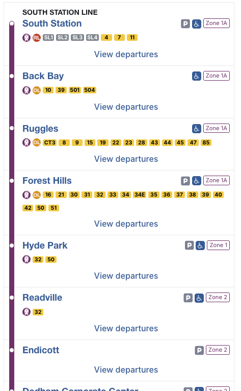
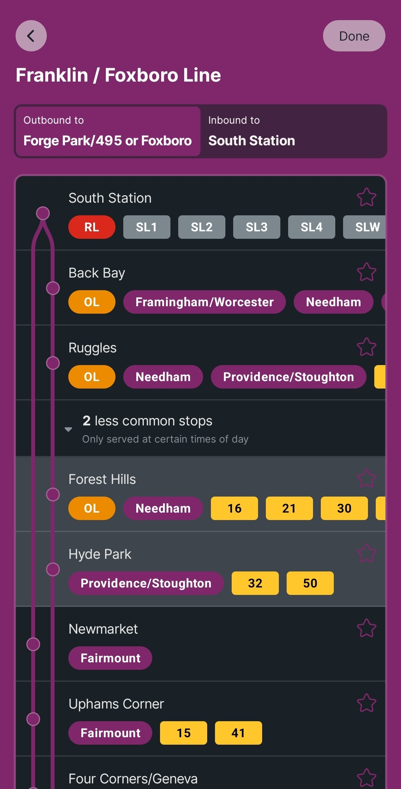

- Feature Name: line_diagram_code_extraction
- Start Date: 2026-08-20
- RFC PR: [mbta/technology-docs#34](https://github.com/mbta/technology-docs/pull/34)
- Asana task: [Write and Share RFC for Mobile App / Dotcom Route Branching Algorithm](https://app.asana.com/1/15492006741476/project/555089885850811/task/1217718594921914?focus=true)
- Status: Proposed

# Summary
[summary]: #summary

Extract the mobile app backend's [route branching
algorithm][route-branching-algorithm] to a shared library, and update
both the Mobile App Backend and Dotcom to use that library to
construct line diagrams.

[route-branching-algorithm]: https://github.com/mbta/mobile_app_backend/blob/e789d30db4ec9616fe5d029a02eb2d45b2217afe/lib/mobile_app_backend/route_branching.ex

# Motivation
[motivation]: #motivation

- The website renders line diagrams differently from the mobile
app.
  - See [screenshots][screenshots] below for examples.
- The Dotcom team is currently in the midst of rewriting the [line
  diagram page][line-diagram-page], and using that project to
  re-evaluate their own line diagram implementation.
- The Dotcom team came to the conclusion that they prefer the mobile
  app's line diagram display, and would like to render line diagrams
  in a similar way.
- Dotcom's current line diagram implementation was built under the
  constraints that existed at the time it was built, and does not
  reflect a desire to preserve the current behavior exactly.
- Dotcom likely does not have the bandwidth to re-implement the mobile
  app's algorithm. This is discussed more in [the alternatives
  section][alternatives].
- If the Dotcom team does not reuse the mobile app's implementation,
  then they have to spend time re-making decisions and re-weighing
  tradeoffs that the mobile team has already done.
- At the department level, we are trying to move towards a pattern of
  *consistency by default*.
  - This doesn't necessarily mean everything must be the same all the
    time, but it does mean that when we're displaying the same
    information across different touchpoints, we would prefer that
    data is displayed in the same way, unless there is a reason to
    display it differently.
- The Alerts Modernization team would be interested in using line diagrams to help users visualize detours and diversions. A shared line diagram library written in Elixir would save them considerable development time for this feature.

[line-diagram-page]: https://www.mbta.com/schedules/CR-Franklin/line

# Proposal
[proposal]: #proposal

The Dotcom and Mobile App teams will work together to extract the
route branching algorithm to a shared library that can be consumed by
both the website and the mobile app backend.

- The shared library will be written in Elixir, and will be imported
  into both the Mobile App Backend and Dotcom
- It will take the appropriate data (route or routes, stop ID’s or
  stops, route patterns) as arguments, and return the appropriate
  combination of `StopGraph`/`SegmentGraph`.
  - Its implementation will be mostly equivalent to the current
    implementation in mobile_app_backend, except that any data lookups
    will be replaced with inputs passed in as parameters.
- The input data structs will be simplified versions of V3 API
  data. Consumers will be responsible for retrieving those bits of
  data from the API and ensuring that they’re duck-typed in such a way
  that they can be passed into this library and/or converted into the
  appropriate input data structures.
- Mobile App code outside of the `RouteBranching` should not need to
  change at all.

Dotcom has two use cases that the mobile app currently doesn't:
- Dotcom line diagrams are alerts-aware - the website shows stops as
  skipped when they're skipped, and shows suspended or shuttled
  portions of the route with a dashed pattern.
  - We can address this by including an optional `alerts` parameter
    that defaults to `[]`. The mobile app would be able to ignore that
    parameter, since their rendering is equivalent to what Dotcom's
    would be when there are no applicable alerts.
- Dotcom shows a diagram for the combined Green Line, and needs to
  continue supporting that use case.
  - We believe we can address this by simply passing the canonical
    route patterns for all of the Green Line branches and letting the
    route branching algorithm do its thing.
  - We may need to add special handling for the case of route ID
    `"Green"`, but since the mobile app doesn't show a combined Green
    Line, they simply won't call the function with `"Green"` as an
    input.

# Drawbacks
[drawbacks]: #drawbacks

- If we want to make changes to the route branching algorithm, that
  will require at least two PR's (one in the extracted route branching
  repo, and one per consumer to upgrade the library version), rather
  than the current 1.
- Local iteration on the route branching algorithm will still be
  possible, but will require temporarily updating the entry in
  `mix.exs` to use `path:` instead of `github:`.
- If we want to make changes on the website and not on the mobile app,
  or vice versa, then we will either need to build knobs to allow for
  divergent behavior, or we will need to restore separate
  implementations.
- The proposed choice to take route pattern data as an input means
  that we won't guarantee consistent results; if both consumers pass
  the same data into the route branching algorithm, then they'll get
  the same results, but they could provide inconsistent inputs, which
  would yield inconsistent outputs.

# Rationale
[rationale]: #rationale

This approach has several advantages:
- This would involve limited change from the current state of the
  world.
- Dotcom and Mobile App Backend would be able to keep their existing
  data storage and fetching paradigms, which would be hard to change.
- Line diagrams will be consistent by default between Mobile App and
  Dotcom.
- This solution would allow the two intentional divergences
  (supporting alert-awareness and the combined Green Line while not
  doing so on the mobile app) with little to no additional effort.
- We wouldn't need to stand up any new infrastructure.
- This could be a good proving ground for uncovering pain points (and
  benefits) of code sharing, with learnings that could be translated
  to other projects as well.
- This approach is a self-contained solution to the problems presented
  above, as well as being a reasonable first step towards other, more
  comprehensive solutions, should we decide to expand the solution’s
  scope later on.
  - See [Future possibilities][future-possibilities] for more ideas.

# Alternatives
[alternatives]: #alternatives

## Adding a line-diagram endpoint to the V3 API
[alt-v3-api]: #adding-a-line-diagram-endpoint-to-the-v3-api

This would involve adding a new endpoint (`/line-diagrams` or
`/route-branches` or something of that ilk) to the V3 API.

### Why?
- Allows Dotcom and Mobile App Backend to handle fetching and
  ingestion pretty much identically to how they handle other V3 API
  data.
- The infrastructure and code is already there both for standing up
  the endpoint and for querying it by its consumers.

### Why Not?
- This is fundamentally a very different concept from anything else
  the V3 API deals in.
- This involves coordination with a third team (Transit Data).

## A New Rider-tools API
[alt-rider-tools-api]: #a-new-rider-tools-api

This would involve standing up a new service that consumes data from
the V3 API, and serves a `/line-diagrams` or `/route-branches`
endpoint similar to the option above.

### Why?

- Allows Dotcom and Mobile App Backend to handle fetching and
  ingestion similar to how they handle other V3 API data, just from a
  different API.

### Why Not?

- This would require new infrastructure.
- Line diagram construction would now require two network hops:
  Consumer → Rider Tools API → V3 API; rather than the current two:
  Consumer → V3 API. This introduces latency and increases the odds
  that at least one of the network hops fails.
  - This could be mitigated by caching, which could improve
    efficiency, but increased technical complexity and risk of getting
    things slightly wrong.
- This is by far the most complex of the solutions proposed.

## Have Dotcom use the Mobile App Backend

The Mobile App Backend already has an endpoint that the mobile app
uses to get line diagram shape data. The Website could call it too.

### Why?

- This would not involve any new infrastructure OR any change to the Mobile App codebase.
- This is likely the approach that would lead to shortest time-to-delivery.

### Why Not?

- This limits Dotcom’s ability to contribute, because it now lives in
  a codebase that’s explicitly owned by a different team.
- This exposes the Mobile App Backend to a new consumer, and possibly
  unexpected load (this could be mitigated by caching).
- The Mobile App Backend is a surprising and unintuitive data source
  for Dotcom.
- This lacks flexibility in case Dotcom wants to handle the Green Line
  combined case, or make the algorithm alerts-aware.

## Library that fetches data and forms it into line diagrams
[alt-library-fetching]: #library-that-fetches-data-and-forms-it-into-line-diagrams

### Why?

- This would make invocation simpler: `LineDiagram.fetch("39")`,
  rather than `LineDiagram.calculate(%Route{route_id: "39", ...},
  [%RoutePattern{...}, %RoutePattern{...}])`
- This could, in the longer term, allow Dotcom and Mobile app to reuse
  data fetching logic as well as line-diagram construction.

### Why Not?

- This approach would require at least one of Dotcom or Mobile App to
  change how they fetch and store data, which isn’t necessary for this
  project.
- If we do decide that this is a good idea, we can do it as a
  follow-on project - line diagram calculation is a first step towards
  this anyway.

## Reimplement Route Branching on Dotcom, but keep implementations separate

### Why?

- This reduces coordination cost associated with working across teams
  by turning a cross-team effort into a single-team project.

### Why Not?

- If changes need to be made (e.g. if the workarounds for the 33 bus
  change), then those changes will need to be made across both repos.
- Relatedly, we lose the benefits of consistency by default.
- Dotcom likely won't have the bandwidth to do this.

## Keep Current Dotcom Line Diagram Behavior

### Why?

- This is the path of least resistance, and is what we're currently
  doing.

### Why Not?

- This presents an inconsistent rider experience, where line diagrams
  on the app render differently from line diagrams on the website.
- This preserves the current (confusing) behavior of the
  [Franklin/Foxboro commuter rail line][line-diagram-page], where the
  shape on the map doesn't match the shape of the line diagram.

# Prior art
[prior-art]: #prior-art

We have limited prior art for extracting existing functionality for
use by multiple teams.

## MBTA Metro

[MBTA Metro][mbta-metro] is a reusable component library currently in
use by Dotcom. It has a wide variety of different types of components,
including accordions, progress bars, badges, as well as MBTA-specific
components like route and mode symbols, and interactive components
like a map.

[mbta-metro]: https://github.com/mbta/mbta_metro/

Metro hasn't seen wide adoption, and the Dotcom team is considering
retiring it or reducing its scope. There are a few reasons for this:

- Because Dotcom is Metro's only consumer, we don't see the benefit of
  code reuse.
- Dotcom does still bear the cost of a separate library, because we
  still have the two-PR-per-change constraint, as well as the extra
  cost associated with local development.
  - Metro in particular is difficult to develop against locally;
    because of quirks related to how it handles assets, simply
    updating its import from `hex:` to `path:` is insufficient.
- No plan was ever made to have any teams aside from Dotcom adopt
  Metro, nor was there any RFC associated with its creation.
- Its scope is broad and not clearly defined.

**Hypothesis:** The well-defined scope of the newly-proposed library,
and the existence of this RFC, will allow us to avoid the pitfalls
above.

## Open Trip Planner Client

[Open Trip Planner Client][otp-client] is a library that Dotcom uses
on the [trip planner page][trip-planner-page] to interface with
OpenTripPlanner. It handles formatting the correct GraphQL request,
and processing the results, including less trivial steps, like
grouping similar trips, even if their routes are different, and
combining interlined trips into a single leg.

[otp-client]: https://github.com/mbta/open_trip_planner_client/
[trip-planner-page]: https://www.mbta.com/trip-planner

This library has not seen wide adoption. The original plan was that
the mobile app team would use it both for finding nearby locations,
and also for their own trip planner feature when they were ready to
add trip planning natively into the app.

However, adding native trip planning isn't on the mobile app team's
roadmap, and the nearby location feature has no feature overlap with Dotcom's
trip planner. That meant that while the library was technically being
used in two places, no code within the library was being used in more
that one place. So the mobile app has inlined their own
[`OpenTripPlannerClient`][mobile-app-otp-client], and modified it to
focus exclusively on the mobile app's use case, leaving Dotcom as the
only consumer of the library.

[mobile-app-otp-client]: https://github.com/mbta/mobile_app_backend/blob/886fffacb3cc39ae13bb15f3638017d03233c1b0/lib/open_trip_planner_client.ex

**Hypothesis:** Since the feature discussed in this RFC is intended to
be shared and mostly identical across the website and the app, we
expect that we will continue to derive benefit from the library being
shared, and neither team will be tempted to inline it.

**Hypothesis:** The pitfalls above are temporary. If we decide that
the mobile app should support trip planning natively, then the
extracted Open Trip Planner Client library will be useful for that.

## Laboratory

[Laboratory][laboratory] is a library that implements cookie-based
feature flags. It has several consumers, including
[Dotcom][laboratory-dotcom], [Signs UI][laboratory-signs-ui], and
[Orbit][laboratory-orbit].

[laboratory]: https://github.com/mbta/laboratory
[laboratory-dotcom]: https://github.com/mbta/dotcom/blob/335523ffb767f78c374ebfda2ea408aec882fb97/mix.exs#L198
[laboratory-orbit]: https://github.com/mbta/orbit/blob/9789dd97d4c158b7bc805339699eff2fc28d26e0/mix.exs#L80
[laboratory-signs-ui]: https://github.com/mbta/signs_ui/blob/47f4d35d3f6e9354b090c10107c07894f119c593/mix.exs#L68

Laboratory addresses a shared concern in a unified way, and makes
adoption easy by presenting a shared interface, and has a narrow and
well-defined scope.

**Hypothesis:** By keeping the scope well-defined, ensure that the
library solves a problem faced by multiple consumers, and making
adoption of this library easy, we will be able to derive more benefit
than cost from maintaining it.

# Unresolved questions
[unresolved-questions]: #unresolved-questions

None at this time.

# Future possibilities
[future-possibilities]: #future-possibilities

In the context of the line diagram and the route branching algorithm,
this project serves as a useful standalone project, and could also be
the first step towards a number of other, more involved
implementations further down the road. Any of the following
alternatives could be built as extensions of this one:
- [Adding a line-diagram endpoint to the V3 API][alt-v3-api]
- [A New Rider-tools API][alt-rider-tools-api]
- [Library that fetches data and forms it into line diagrams][alt-library-fetching]

This project can also serve as a relatively simple and low-risk case
study for future extraction and sharing projects. We will be able to
use lessons from this project to help inform whether to embark on
other code reuse projects in the future, and if we decide to do so,
we'll also be able to use these lessons to help ensure that future
projects are successful.

# Screenshots
[screenshots]: #screenshots

### Dotcom Line Diagram

### Mobile App Line Diagram

