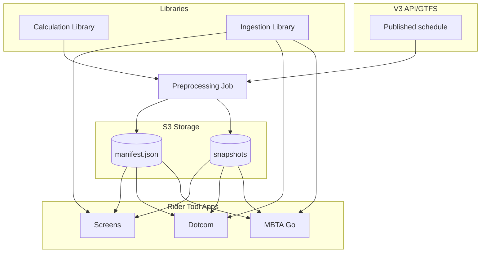
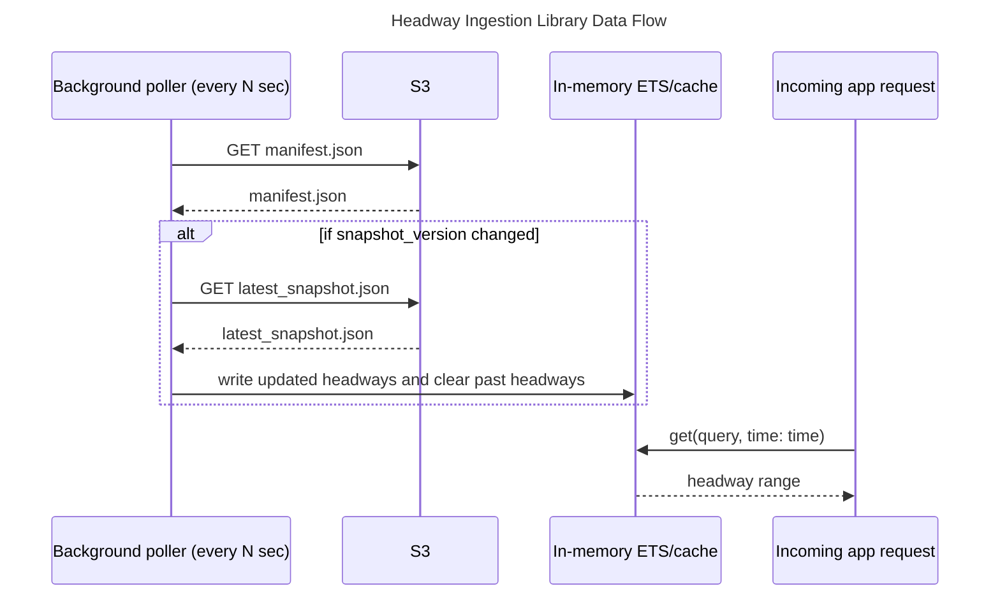

- Feature Name: `shared_headways_library`
- Start Date: 2026-09-30
- RFC PR: [mbta/technology-docs#0036](https://github.com/mbta/technology-docs/pull/0036)
- Asana task: [Shared Headways - Initial Architecture](https://app.asana.com/1/15492006741476/project/1185117109217413/task/1217000215475461)
- Status: Proposed

# Summary
[summary]: #summary

This proposal details the goals of and plan to create a Headways Elixir Library that handles the calculation and caching of low and high time ranges, readable as "trains/buses every `low` to `high` minutes".

# Motivation
[motivation]: #motivation

When there are no predictions for a subway route but service is running, we want to show headway information (i.e., “Trains every 8–14 min”). Headway display behavior is currently implemented on some screens, but we want to extend it to all screens, the website, and MBTA Go. Additionally, we want all of these touch points to behave consistently, both in terms of when and what headways they show.

We have scoped this Library to support the following goals for its launch:
- Provide one common mechanism for all Rider Tools applications to obtain service headway information for subway, light rail, and the Silver Line, so riders see consistent values regardless of channel.
- Replace the current need for OIOs to manually enter headway values with an automated, schedule-derived calculation.
- Headway values available by stop/platform and direction. At stops serving multiple destinations in the same direction, we show a combined headway ("Southbound trains every lo-hi min"), **unless** the touchpoint is specific to a platform that serves a single destination, like the Ashmont and Braintree platforms at JFK/UMass, in which case we show that destination's headway ("Ashmont trains every lo-hi min").
- Leave room for future route-specific headways without redesigning the data contract now.

Although the following are not goals for launch, this design *could* be extended to support the following in the future:
 - Support headway value overrides, without making manual entry the normal workflow.
 - Fallback values in the case of missing or corrupted data for a given query.
 - Separate headways for branches of the Green Line at stops that serve multiple destinations.
 - Share logic for when headways should be shown. Given that we want to show headways when predictions are unavailable, we can trust consumers to handle this piece for when it's an option. However, we also could share logic for when headways should *not* be shown. When service is not normal and we know headways will be inaccurate, we may want a mechanism to prevent headways from being shown to riders.

# Proposal
[proposal]: #proposal

### Interface

We would create the following APIs within the `Headways` module:

```elixir
# Will need to pass information on accessing the V3 API to the library on startup
# Creates the ETS table and returns immediately; the initial schedule fetch and calculation happen in the background. Until the first load completes, {:error, :not_loaded} is returned on get attempts.
# A failure to reach the V3 API will never prevent the consumer application from starting.
Headways.start_link(config)

# Force a refresh of headways data asynchronously and return `:ok` immediately. 
# Only one refresh runs at a time. If a refresh (manual or scheduled) is requested while one is already in progress, it won't be queued since schedule data rarely changes.
Headways.refresh()


# Lookup types for fetching headway ranges from the cache
# Child platforms do not require explicit direction or route.
# For parent stations, we must explicitly select direction and normalized route.
@type query ::
        %{stop_id: String.t()}
        | %{
            parent_stop_id: String.t(),
            direction_id: 0 | 1,
            route_id: String.t()
          }

# Tuple representing the low and high range of headways for a given lookup
@type range :: {low :: pos_integer(), high :: pos_integer()}

# Returns a single headway range. By default, returns the range for the current time.
@spec get(query()) :: {:ok, range()} | {:stale, range()} | {:error, reason}
@spec get(query(), opts) :: {:ok, range()} | {:stale, range()} | {:error, reason}
Headways.get(%{stop_id: stop_id})
Headways.get(%{stop_id: stop_id}, time: time)
Headways.get(%{parent_stop_id: parent_stop_id, direction_id: direction_id, route_id: route_id})
Headways.get(%{parent_stop_id: parent_stop_id, direction_id: direction_id, route_id: route_id}, time: time)

# If a consumer needs a per-route breakdown, we can have the following
@spec get_all(parent_stop_id, direction_id, opts) :: {:ok, %{route_id => range()}} | {:stale, %{route_id => range()}} | {:error, reason}
Headways.get_all(parent_stop_id, direction_id)

```

#### Parent stations and platforms

The `get(query, opts \\ [])` function accepts a typed query map with two supported shapes that both resolve to the same internal cache lookup and return the same result type. 

- **Child platform:** `%{stop_id: stop_id}` infers direction and normalized route from the platform's schedule metadata. The range is calculated only from departures at that platform. Use this for touchpoints tied to a specific platform, such as PA/ESS screens.
- **Parent station:** `%{parent_stop_id: parent_stop_id, direction_id: direction_id, route_id: route_id}` calculates the range from departures for the selected normalized route in that direction across the station's platforms. Use this for touchpoints that describe the whole station.

For example, at JFK/UMass the southbound Ashmont and Braintree branches use separate platforms. You could look up both the parent station and either of its child platforms:

```elixir
Headways.get(%{parent_stop_id: "place-jfk", direction_id: 0, route_id: "Red"})
#=> {:ok, {4, 7}}

Headways.get(%{stop_id: "70085"})
#=> {:ok, {8, 13}}
```

#### Failure handling and staleness
If a scheduled refresh fails, the library keeps serving existing cached data and retries at the next scheduled refresh. Because headways are schedule-derived and calculated per fixed time window, data for a window remains valid even if later refreshes fail.

If no data exists for the requested window, the library  falls back to the most recent prior window and returns `{:stale, range}`, allowing consumers to decide whether to display it. 

The library emits `:telemetry` events for refresh success and failure so consumers can log and alert on repeated failures.

### ETS Cache Design
[ets-cache-design]: #ets-cache-design

We will use ETS for request-time lookup, and store a range of headway values for each stop/direction/route combination. We will store headway ranges for a 2-hour time window, and store the upcoming time window in ETS as well to guarantee consistency between consumers as we advance between time ranges. We will progressively delete expired time windows from the cache as we move past them and add values for the next time windows.

For the Green Line, we will consolidate each true route (Green-B, Green-C, Green-D, and Green-E) into a single representative “Green” since we won’t support branching headways. 

A key for the ETS cache would be a tuple of `{stop_id, direction_id}` in the case of parent stations, or just the `stop_id` when looking up child platform IDs. The value for each key is a list, which can contain multiple entries for different routes and time windows.

Because platform assignments come from the published schedule, any platform served by a single destination (such as the Ashmont and Braintree platforms at JFK/UMass) automatically gets a destination-specific range, without special-casing particular stations. If the schedule routes multiple destinations to the same platform, its range reflects all of them.
    
The example below shows the value for the key `{"place-pktrm", 0}`. It includes two time windows for the “Red” route ID to demonstrate how it may look when we are about to cross between time windows and have pre-emptively calculated and stored headways for the next window.
    
```elixir
[
    {
        route_id: "Red",
        headway_lo_hi: {5, 8},
        time_start: "2026-09-30T07:00:00-04:00",
        time_end: "2026-09-30T09:00:00-04:00",
    },
    {
        route_id: "Red",
        headway_lo_hi: {6, 10},
        time_start: "2026-09-30T09:00:00-04:00",
        time_end: "2026-09-30T11:00:00-04:00",
    },
    {
        route_id: "Green",
        headway_lo_hi: {2, 4},
        time_start: "2026-09-30T07:00:00-04:00",
        time_end: "2026-09-30T09:00:00-04:00",
    }
] 
```


### Calculation Policy

We will generally be going with the approach outlined during earlier experimentation done before this RFC ([see Notion](https://app.notion.com/p/mbta-downtown-crossing/First-Pass-at-Headways-2e1f5d8d11ea80839400fb6a1c1caaef?source=copy_link)). The calculation logic within the library will do the following:

1. Read the published schedule using the V3 API for a 2 hour time window. Note that the time windows will extend beyond 2 hours for the start and end of service. Within a service day, these time windows will be service_start-7AM, 7AM-9AM, 9AM-11AM, 11AM-1PM, 1PM-3PM, 3PM-5PM, 5-7PM, 7PM-9PM, 9PM-11PM, and 11PM-service_end.
2. Normalize records by platform stop_id, direction, and normalized route.
3. Merge scheduled departures from all qualifying routes serving that platform/direction.
4. Compute intervals between the departure time of consecutive departures.
5. Summarize intervals within defined time windows into a rider-facing range. Set a minimum floor value of 1 or 2 minutes.
6. Publish results as effective periods rather than recalculating per request.
    
```elixir
defp headways(schedule_list, date, time) do
    start_time = DateTime.new!(date, time, "America/New_York")
    end_time = start_time |> DateTime.shift(hour: @window_hours)

    schedule_list
    |> Enum.map(& &1.time)
    |> Enum.sort(DateTime)
    |> Enum.reject(&DateTime.before?(&1, start_time))
    |> Enum.reject(&DateTime.after?(&1, end_time))
    |> Enum.chunk_every(2, 1, :discard)
    |> Enum.map(fn [t1, t2] -> DateTime.diff(t2, t1, :minute) end)
    |> Enum.min_max()
end
```

We will want to calculate these headways on some regular cadence that is matched between apps. Headways will only need to change when there is an update to existing or new schedules entirely published. We can check if this is the case by fetching from the V3 API's `status` endpoint. If this status indicates that new Schedule data has been published, then we fully fetch schedules from the API and recalculate headways. A good cadence for this check and subsequent calculation could be every 2 hours on the 45 minute mark to guarantee that we have fresh values before a new time window begins.

### Data Storage Details

How much data would we need to store headway all the discussed headway data in an ETS cache within an Elixir application?

Let’s do some quick math!

- **143 active station/route combinations** (excluding branching routes and the ~10 child platforms we will store)
- **2 directions** per station/route (excluding terminals, but let’s leave them in to round up)
- In JSON, each entry is about ~300 bytes. In decoded Erlang, accounting for nested maps, integers, etc., the size increases. If we’re being pessimistic, we can estimate an increase to around **1.5 KB per entry**.
- **For a given time window,** we thus are only storing **450KB for parent station entries (rounded up).**

Even if we assume that we’ll be storing multiple time windows at once (which may be necessary if the website wants to show more representative instead of current headways), keeping 10 would increase this to only 4.5MB. Accounting generously for an indexing structure, this ETS table would still be storing less than 10MB.

In conclusion, storing all headway data in ETS should be quite manageable.

### Implementation and Rollout Plan

We propose creating the initial library within the Screens application. Since we will potentially be making many small tweaks after the initial rollout, we can do this within Screens for speed and simplicity. Once we feel confident that the Headway algorithm and library is relatively stable, we can pull it out to an individual library.

1. Define and approve the calculation and consolidation policy against representative subway,  light-rail, and Silver Line examples. 
2. Implement the full Shared Library caching logic and API to be used by Screens.
3. Run new calculation in shadow mode against Screens' existing manual values to report differences.
4. Migrate to fully use the new library within the Screens application.
5. Once we’re confident and the library is stable, move the library to a different repository, `Headways`, where it will live on its own.
6. Migrate the other Rider Tools applications, Realtime Signs, Dotcom, and MBTA Go.

### Testing
[testing]: #testing

Because the library fetches from the V3 API when it starts, consumers need a way to run their test suites without network calls or time-dependent data. The library will support this by:

- A config option, such as `fetch: false`, that starts the ETS table without scheduling any calls to the V3 API, so the library can stay in the consumer's supervision tree during tests.
- A test helper for seeding the cache with fixed headway entries, so consumers can control what the get functions return:

```elixir
Headways.Test.put(stop_id, direction_id, route_id: "Red", range: {5, 8})
Headways.Test.clear()
```

Alternatively, `Headways` could expose a behaviour for consumers to swap in a mock with `Mox` instead of the real module.

# Drawbacks
[drawbacks]: #drawbacks

- We may see drift in the displayed headways as we publish updates to the library, since each application will independently ingest it as a dependency. That inconsistency is the main cost of choosing the simpler deployment model. It also means there is no built-in override mechanism without adding extra infrastructure or operational work.
-  It multiplies V3 API load compared to an approach with centralized Headway calculation, since each consumer will individually call the Schedules endpoint of the API within each instance of their application.
- It could be harder to debug a case like "why did Screens and Dotcom show different values?" without shared logging.
- The library will run processes inside every consumer's supervision tree.

# Alternative Approaches
[alternatives]: #alternatives

## API Endpoint for Headways

An API-based design would provide a single authoritative implementation, immediate propagation of updates across all apps, and centralized observability and override handling. 

### Why not this approach?

We are not choosing this approach because it would require significant API ownership and deployment work, and the headway calculation is still ultimately a schedule-derived, cache-friendly lookup problem rather than a core backend service. Doing the work at request time could also be expensive, and it would encourage duplicated operational logic and caching behavior across each application. A full API also imposes a more rigid data model than we need for this initial release.

This would be the right direction only if we expected a broader set of shared platform concerns, including centralized overrides, cross-channel timing control, or operational management that only a service layer can provide. For this RFC, those requirements are not sufficient to justify the added complexity.

## Reading GTFS Static Directly

The library could download and parse the GTFS static feed directly instead of requesting schedules from the V3 API. This approach would avoid depending on the API for schedule retrieval and could be a good fit if schedule processing were centralized in a preprocessing job or moved into the V3 API itself.

### Why start with the V3 API?

For the initial implementation, the V3 API is the lower-risk and more practical choice:

- The library initially needs schedules for subway, light rail, and the Silver Line. The static feed includes schedules for the entire system; most of the data in `stop_times.txt` is for bus service that is out of scope. The current `stop_times.txt` is approximately 150 MB, while the V3 API can return schedules filtered to the routes and time periods the library needs. Since each application instance runs its own copy of the library, downloading and parsing the full static feed in every consumer could add avoidable network, CPU, and peak-memory costs.
- Most Rider Tools teams, particularly the Screens team who will do the initial implementation, already have deep experience working with the V3 API and its schedule data. Reusing that path should shorten implementation and onboarding, help deliver the feature sooner, and make it easier to maintain.

If schedule ingestion is later centralized in a hybrid architecture or the V3 API, we can reconsider parsing GTFS and relatively easily swap between the two ways of fetching relevant schedule data.

## Hybrid Approach

A Hybrid approach would preprocess headway data, write it to a shared store, and then use a shared ingestion library in each Rider Tools app to fetch and cache the dataset locally. This would give us many of the benefits of a centralized system without making each application depend on a live runtime API. It would keep reads cheap and cacheable, and it would allow for consistent results and extensibility with overrides.

### Why not this approach?

The Hybrid model is attractive because it addresses the main weaknesses of a Shared Library: drift across applications and extensibility for overrides/defaults. However, it also requires more infrastructure and operational complexity than this initial effort needs. It introduces additional storage, deployment, and maintenance concerns, and it is a bigger commitment than the team needs to achieve the initial goals of this effort.

For this phase, the simplest model that still meets the goals is the Shared Library itself. It keeps the implementation straightforward, minimizes infrastructure overhead, and lets each app use the same schedule-derived logic with a consistent cache strategy. We believe that the incremental gains from a Hybrid system do not outweigh the operational cost in the near term.

# Prior art
[prior-art]: #prior-art

The main existing prior work to extract common functionality into a shared library has not yet been implemented but was proposed in [RFC 34](./accepted/0034-shared-line-diagram-implementation.md)

## V3 API Pattern from RFC 34
An earlier design discussion raised a relevant question based on the recently accepted RFC 34, which proposed a shared library for route branching diagrams. In that design the consumers of the library were responsible for fetching data from the V3 API given that applications already have their own preferred mechanisms for fetching and caching API data. The question was: is there a good reason for this library to diverge from that pattern?

In the headways case, schedule fetching and parsing makes sense to live inside the library for a few reasons:

1. The headways cache will update and fetch schedules infrequently, checking for updates to schedules every 2 hours, and without a latency requirement. These V3 API calls should therefore live outside each application’s normal V3 caching flow, rather than being mixed into a consumer’s existing cache of API responses.
2. Headway updates run on a scheduled refresh cadence, unlike the line map diagram use case. That makes it simpler to keep the fetch/update lifecycle inside the library itself, rather than requiring applications to call an `update` function and pass schedule data in manually.
3. Consumers would not need to build adapters to transform their `Schedule` structs into the format required by the library.
4. Centralizing schedule fetching reduces the risk of small discrepancies when fetching the same data across consumers, which could otherwise lead to different headway calculations between applications.

This is not to say that the RFC 34 pattern is wrong in general. There is some risk of overall cognitive overhead if different shared libraries follow different patterns of data storage and retrieval, and it is also not obviously ideal to fetch and parse the same schedule data multiple times across multiple shared libraries. That said, since we are still in the early stages of shared-library development, there is value in trying different patterns to identify where the tradeoffs are real and where the pain points are minimal.

For this RFC, though, we are choosing the more centralized library-owned fetch pattern because the headway problem is scheduled, low-volume, and sensitive to consistency. We want the library to own the schedule read and normalize path so each application does not need to recreate that logic or risk drift from slightly different fetch implementations.

# Unresolved questions
[unresolved-questions]: #unresolved-questions

- What parts of the design do you expect to resolve through the RFC process before this gets merged?
  - Can we align on having the Schedule fetching be handled by the Library?
- What parts of the design do you expect to resolve through the implementation of this feature
  - Will the Screens team own the Library after its release?
  - Is 1 minute a reasonable lower bound for headways, or should the minimum floor be 2 minutes?
  - At what point is headway data too stale to be displayed to riders? Should this be configured by application, or set to a standard value in the library?
  - How much of an impact do outliers have on the headway calculation for less frequent routes, such as GL and RL branches? Will we need to shorten the headway range windows to percentiles at a certain length of time threshold?


# Future possibilities
[future-possibilities]: #future-possibilities

## Extensions within a Shared Library
[extensions-within-a-shared-library]: #extensions-within-a-shared-library

### Headways for Green Line Branches at Trunk Stops

On Dotcom, there is a potential use case for showing individual branches of the Green Line, even at shared stations. For example, on the Green Line D Branch departures page at Copley, it would be a bit odd to show all-Green-Line headways.

Instead of only having the consolidated `route_id` of "Green" for trunk stops on the Green Line, we could include specific `route_id` values that are calculated and populated for each branch available at the stop. This would be simple to support. 

Red Line branches that use separate platforms (such as at JFK/UMass) are already supported through platform-level lookups. What would need a data structure change is separating branches that share a platform, where the underlying `route_id` and platform are the same but the destination differs. This does not seem like a need from any consumers at this point, so supporting Green Line branches as discussed should work.  

### Representative Headway Values

We could add a JSON to the library that is strictly default values for headways by stop in the event of failures reaching the V3 API.

The argument to do this is in case of a hypothetical incident that affects both Predictions and Schedules from the V3 API. In this case, all of our Rider Tools applications would try to fall back to showing headways, but would not have the data to do so. 

### Overrides
[overrides]: (#overrides)

We could create a UI with some light infrastructure, similar to Signs UI’s current headway value mechanism, which updates Headways in a JSON file accessible by all of the Rider Tools apps. We can then check the override file when updating the ETS cache with Headway values.

Overrides could also extend to overriding headways from being shown entirely. This behavior has been raised as having possible value given that there are times when we might be missing predictions and also believe that headways will be unreliable and frustrating to riders.

In order for these overrides to be reflected in real time, we may need additional infrastructure so that the Library picks up any such updates. For this to be achieved cleanly, we may need to extend beyond a library; see the Hybrid Architecture discussed below for further details.

## Hybrid Architecture as an Extension
[hybrid-architecture]: (#hybrid-architecture)

This is a breakdown of how a Shared Library could be extended to a Hybrid Architecture approach, which we discussed as an alternative approach earlier. Although this would require additional infrastructure setup and maintenance, we could keep it in mind for the future to improve the consistency between consumers and more easily enable extensions like overrides.

At a high level, the preprocessing job will calculate headways, write them to S3, and then each Rider Tools App will use a shared Ingestion Library to update headways in their own application. The following sections will go into more detail.

### Components



1. **Libraries:** The calculation half of this library is pure domain logic that accepts scheduled departures and produces a JSON snapshot and manifest. The Ingestion Library would be used by all Rider Tools app, and is described in more detail later in this doc.
2. **Preprocessing Job:** Runs on a set schedule or on GTFS changes and writes to S3. 
3. **S3 Storage:** A manifest plus versioned JSON snapshots in object storage. 

### Ingestion Policy

The shared client library will own fetching, manifest and snapshot parsing, schema validation, refresh polling, caching in ETS, and the `get` lookup. Applications will only need to configure the manifest URL, and perhaps some small options, like how often to poll the manifest. 



### Data Contract

The manifest is a tiny, frequently-overwritten pointer file that contains metadata about which snapshot is currently authoritative.

```json
{
  "schema_version": 1,
  "snapshot_version": "2026-09-17T120000Z",
  "snapshot_url": "headways/snapshots/2026-09-17T123456Z.json",
  "generated_at": "2026-09-17T12:34:56Z"
}
```

The snapshot JSON files will look like those discussed within the [ETS Cache Design](#ets-cache-design) of the Shared Library.

#### Versioning and Breaking-Change Strategy

Three independent version axes avoid forcing synchronized upgrades.

- `snapshot_version`: which data (changes continuously)
- `schema_version`: shape of the JSON (changes rarely)
- `library_version`: parser code (semver; tracks schema support)

We will follow these proposed rules:

1. Parsers ignore unknown fields; adding optional fields is a `snapshot_version`only change.
2. Required-field changes require a new `schema_version`, published at a distinct path like `headways/v2/latest.json` alongside the old one.
3. The writer dual-publishes old and new schema versions until all known consumers have migrated.
4. Client library major versions track schema support windows (i.e. `1.x` parses schema 1 only; `2.x` parses schema 1 and 2; `3.x` drops schema 1 after migration completes)
5. A client encountering an unsupported `schema_version` fails closed and continues serving its last known good snapshot rather than crashing or parsing incorrectly.
