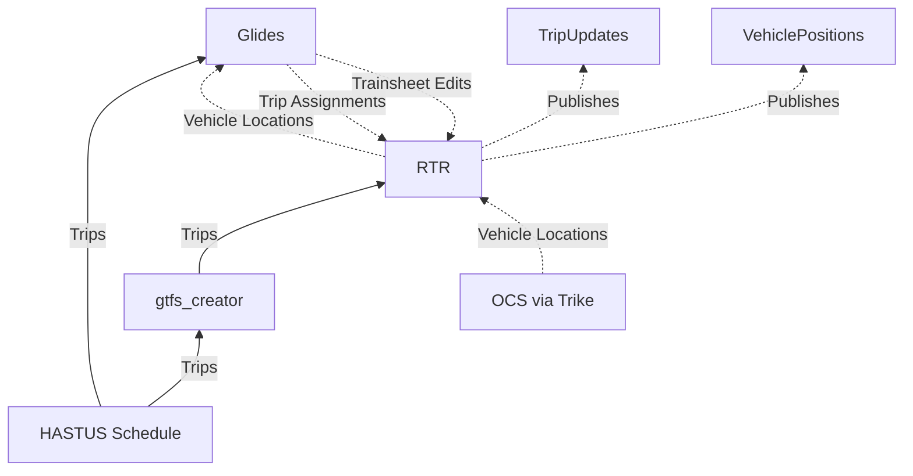
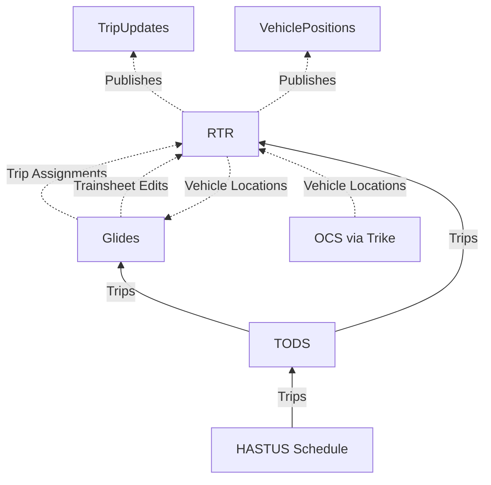

- Feature Name: Consistent Light Rail Trip Model Across TID Applications
- Start Date: 2024-05-16
- RFC PR: [mbta/technology-docs#25](https://github.com/mbta/technology-docs/pull/25)
- Asana task: n/a
- Status: Accepted

# Summary
[summary]: #summary

This document establishes a North Star vision to guide us towards a shared model of light rail trips that supports various TID goals, primarily in the Transit Technology program area but also having relevance to Rider Tools.

# Motivation
[motivation]: #motivation

The concept of a "trip" is core to essentially all transit systems, and therefore to all transit data as well. Trips are associated with, and tie together, many other important entities in our data model, including:

- Route
- Vehicle
- Operator(s)
- Headsign
- Block
- Run
- Various service adjustments or interventions
- Scheduled stop times
- Predicted stop times
- Actual stop times (in the past for historical instances of trips)

This list is not exhaustive, and in some applications these other entities or data points may be accessed by joining via other parts of the data model as opposed to looking directly at a trip, but hopefully it impresses the importance getting trips right.

## Present shortcomings

Currently, however, our model of trip data on light rail leaves a great deal to be desired. For historical reasons, MBTA light rail vehicles have had neither on-vehicle systems by which an operator can assign their vehicle to a particular run (as in the case with bus) or a centralized dispatch system with its own model of trips and trip assignment (as with heavy rail). Furthermore, inconsistencies in how light rail trips are modeled across systems, related to peculiarities like having both a lead car and a trailer car that both need to have an operator scheduled, lead to more difficulty in exchanging data across systems. This situation creates a variety of tangible problems:

1. Glides needs to perform complicated logic when importing schedule data from HASTUS to transform it into a model that matches the Glides trainsheet interface.
1. Our passenger information (RTR) and dispatch (Glides) applications both implement their own logic to associate vehicles with trips, duplicating effort across teams while also creating additional confusion.
1. Glides does not publish trainsheet changes using trip IDs that directly correspond to the trip IDs used by GTFS, further complicating the logic in RTR that has to assign trips to vehicles.
1. Because RTR has to guess as to the correct trip to assign to a train, trip IDs published in our predictions are often not very sensible, or we give up on guessing a scheduled trip completely and assign a train to an added trip. As a result, passenger-facing systems such as mbta.com or screens that may wish to display both scheduled and predicted departure information can't always be sure if two trips with different IDs in the schedule versus the realtime data are actually "the same." Showing scheduled and realtime data for the same trip side-by-side is also a common pattern in third-party applications, so when a trip fails to match to the schedule the result is a combination of a scheduled trip without realtime tracking and a realtime arrival prediction without a corresponding scheduled time, creating a confusing experience for users.
1. Analysis of historical data for performance purposes is also complicated by the difficulty in linking a trip from the schedule with a trip from the (historical) realtime data, such as that archived by LAMP.

In addition to the technical challenges, this also creates unclear ownership of different parts of the data pipeline, with different teams implementing their own logic piecemeal to serve their own needs.

## Guiding principles and assumptions

Finally, I want to take a second to lay out some goals that have guided the decisions in this RFC:

1. Having a single source of truth for data.
1. Creating clear understanding between teams about ownership of different parts of the data pipeline.
1. Balancing the needs of internal operations users and public-facing users.
1. Staying as close as possible to the most basic common denominator in data across TID systems, in this case GTFS trips. This means that improvements benefit as many teams and applications as possible, and we adhere to the principle of "small pieces, loosely joined" by a common standard.

The TID data architecture does not exist in a vacuum. For our purposes in this RFC, the main outside factor that we need to be aware of is the HASTUS system used for scheduling and the Plans & Schedules team that uses it to produce the new light rail schedule every rating. Challenges in this area, in particular around schedules during disruptions, will be factored in.

# Guide-level explanation
[guide-level-explanation]: #guide-level-explanation

The below diagram gives an overall view of the proposal. Solid lines represent static data, whereas dotted lines represent realtime data:

## Schedule data: HASTUS and TODS

Glides will move towards using the HASTUS-provided trip ID in its schedule data. Currently, Glides [generates its own](https://github.com/mbta/glides/blob/fbe9578c8400b955304c74d34e672460a0d17a23/lib/glides/import/import_scheduled_trips.ex#L184) trip ID during the rating import process. The import code can be modified between ratings, and the next rating import will simply apply the new logic. These are the same trip IDs that GTFS ultimately uses (barring disruptions), so this means that Glides will have a foreign key it can use to communicate with other systems like RTR more easily, and the existing trip ID column can be reused. There is some subtlety about exactly what we mean by "HASTUS-provided trip ID," which is elaborated on in the [Reference-level explanation](#reference-level-explanation).

In the future, Glides will move to importing scheduled trips from the [Transit Operational Data Standard (TODS)](https://ods.calitp.org/) file produced by Transit Data. This will similarly use trip IDs sourced from HASTUS and so the trip ID logic will not have to change, although the `schedule_id` we currently use will likely need to be replaced with a `service_id` to match the GTFS-based TODS standard. This change should be largely orthogonal to other changes proposed in this document, and may happen before or after the work proposed here. If the move to TODS happens before, then discussion of TODS should supersede the parts of the proposal that pertain to using HASTUS data directly.

The use of TODS will slightly modify the overall architecture diagram from above (assuming that RTR reads data from TODS as well):

## Realtime data: Glides trainsheets and RTR

In the first stage, RTR and Glides will continue to maintain their own separate trip assignment systems, but Glides will begin sending HASTUS-based trip IDs in trainsheet update events. For scheduled trips, the [trip key published in `glides.trips_updated` events](https://mbta.github.io/schemas/events/glides/com.mbta.ctd.glides.trips_updated.v1#tripkey) will need to have a new field added (perhaps called `tripId`, final name to be determined) and this field will need to be documented. The `serviceDate` will still need to be present in order to map from HASTUS schedule IDs to GTFS service IDs. The [Glides code that generates the trip key for the event](https://github.com/mbta/glides/blob/fbe9578c8400b955304c74d34e672460a0d17a23/lib/glides_web/channels/trainsheet_channel.ex#L1324) already has access to the `ScheduledTrip` with its trip ID, so once we are importing the trip ID from HASTUS we will simply be able to reference that. This will be a backwards-compatible change, so the schema version can stay the same.

RTR will use the trip IDs from the trainsheet edit events when determining what trip ID to publish for a vehicle matching that trip. The trip matching logic itself will still live with RTR at this point, but if RTR believes that a train is a particular trip from the trainsheet, it SHOULD use the corresponding trip ID in the public GTFS-rt feed. However, if a train that is assigned to a scheduled trip from Glides changes state in such a way that it should be assigned to a different trip by RTR's logic (for instance: unexpectedly going off its current pattern, or changing directions), RTR MAY assign that train to a different trip of its choosing. RTR will still be free to create its own added trips as needed.

Additionally, RTR will need to handle cases where current service as reflected in GTFS static does not match the HASTUS-based trainsheets in Glides, due to planned disruptions modeled by `gtfs_creator`. In these cases, the data will manifest as trainsheet update messages with HASTUS-based trip IDs that do not match up with the trip IDs currently running per the GTFS static schedule. This will continue to be a potential issue, even with trip matching handled in Glides, so it is explored in more depth in the [Reference-level explanation](#reference-level-explanation) section.

This intermediate state is proposed to allow for a more incremental implementation that's easier to deliver and provides some value without requiring too much deep refactoring of RTR. It can optionally be skipped if the Glides and Transit Data teams collectively decide that it creates more net work for not enough additional benefit.

## Train - trip assignment feed

In a future state, Glides will be responsible for light rail trip assignments, and generate a new event feed of train-to-trip assignment events. RTR will use this as its primary source of information 

# Reference-level explanation
[reference-level-explanation]: #reference-level-explanation

## GTFS and TODS schedule data

Light rail schedule data in GTFS and (eventually) TODS files will be produced by `gtfs_creator` based on an export from HASTUS. The HASTUS trips for the lead car will be the basis for GTFS trips, and GTFS trips will take on their IDs. Integrating the schedule for multi-car trips (that is, trips with a trailer) into the TODS data will be defined in a separate discussion about the adoption of TODS. When `gtfs_creator` takes a trip from HASTUS and outputs it with only minor factual corrections, it SHOULD retain the original trip ID. However, if a trip is actively modified as part of the `gtfs_creator` disruption modeling process, its ID MUST be changed so as to not overlap with the HASTUS trip IDs.

## Glides schedule import

Glides will import schedule data from either its own HASTUS export or, in the future, TODS. In either case, trip data is loaded into the `scheduled_trips` table. The HASTUS trip ID will be used directly to populate the `trip_id` column. While working directly with HASTUS, some modifications will be necessary to which IDs we actually use. Currently, our export gets a column called `trp_number`, but the actual, database-unique ID is called `trp_int_number`, and the latter is also the value published by `gtfs_creator`. The significant different here is that cars grouped into one logical trip all have the same `trp_number` generally, but as `trp_int_number` is database-unique, that value will differ. We want the benefits of both combined trip information for multiple cars as well as uniqueness and agreement between systems. To achieve this, we will combine the trips for the different constituent cars and determine the ultimate ID in the following manner:

1. Group the trip entries for each schedule ID by the `trp_number` value.
1. For each resulting group, take the trip record for the lead car and use its `trp_int_number`.
1. Use information about the trailer trip for data like the run number, but discard its `trp_int_number`.

It is worth noting that there have been cases in the past where `trp_number` hasn't been unique across different logical trips, so this may be worth addressing with the relevant teams generating the schedule or adding additional safeguards against.

The trip combining logic described above will likely not be relevant for Glides directly if Glides uses TODS as opposed to HASTUS input, but creating a TODS file that fully represents the light rail data we need will likely need to address this concern as well, so this suggestion may still be relevant for the Transit Data team to consider.

## Glides trainsheet edit events

The `com.mbta.ctd.glides.trips_updated` event schema will be modified to include a `tripId` key, where the `tripId` is sourced from the `trip_id` column of `scheduled_trips` for a scheduled trip, or the auto-generated Glides ID for an added trip.

## Glides train - trip assignment events

A new `com.mbta.ctd.glides.vehicle_trip_assignment` event will be established. The exact schema will be defined via the pull request review procedure on the [`mbta/schemas`](https://github.com/mbta/schemas/) repository, but there are some basic criteria that can be established. Events will at least have a `tripId` and `vehicleId` key. The `tripId` will be the scheduled or added trip ID from Glides, and the `vehicleId` will correspond to the ID of the vehicle in the GTFS-rt feed. Each event will represent the assignment of the given `vehicleId` to the given `tripId`. Either a variation of this event or a separate event will exist for unassigning a vehicle from a trip.

The Glides application will be primarily responsible for establishing the train - trip matching. While exact details of the logic are beyond the scope of this RFC, factors that are likely to be weighed include:

1. Cars entered for trips on trainsheets
1. Additional mid-line edits to trips by Glides users, however those are represented
1. Train movement (for instance, marking a train as no longer assigned to a trip when it reaches that trip's endpoint, or assigning it to a different trip if appropriate)
1. Train location (for instance, marking a train as no longer assigned to a trip if its current location is no longer on the path from the start point to the end point, including being headed in the correct direction)
1. AVI code (indicating train destination)

### Required properties of Glides-produced trip assignments

While there are not hard requirements around this, Glides SHOULD generally try to produce trip assignments for any vehicle tracking in the realtime data that is operating on the mainline (as opposed to in a yard). This is important for RTR to be able to make predictions without doing additional trip assignment logic (any train operating in service should be getting predictions, whether revenue train predictions in the public GTFS-rt feed or non-revenue predictions for in-station announcements about trains that won't stop). Additionally, it has benefits for operations (having a trip in the internal Glides data model provides a location to store any additional metadata, such as notes). For the time being, trip matches performed to provide a placeholder trip for a train not associated with a trip explicitly via the cars entered on a trainsheet will generally be ADDED trips that do not appear on the trainsheet interface. They will, however, generate corresponding `com.mbta.ctd.glides.trips_updated` events creating those added trips.

Once this feed is implemented, RTR MUST adopt it as its source of truth for determining trip assignments in the data that it publishes. If RTR receives a `vehicle_trip_assignment` event for a trip ID that it does not recognize (via either the GTFS schedule or via a trip add `trips_updated` event), it SHOULD map that to a unique added trip ID of its own and maintain that mapping in the GTFS-rt feed for the duration of the trip (that is, the unrecognized trip ID from Glides should not suddenly become mapped to a different randomly-generated added trip). This is to handle the case where RTR is aware of a different set of trip IDs due to a disruption modeled in `gtfs_creator` but not in HASTUS. See [Rationale and alternatives](#rationale-and-alternatives) for some brief discussion of the tradeoff involved here.

### Required data for Glides to produce trip assignments
[required-rtr-data]: #required-rtr-data

Having Glides handle all trip assignments will require Glides having a direct feed of all vehicle position data. Currently, RTR excludes some known non-revenue yard pull-outs and pull-backs, which makes sense from a passenger information perspective. Internal consumers like Glides will need a more direct feed of the data before any filtering is applied, in addition to certain non-public data fields like the train's AVI code. While the exact mechanism for achieving this is out of scope for this RFC, it is worth noting as a requirement as it relates to other discussions around re-architecting RTR. One possibility that has been discussed is splitting RTR into a data aggregation and state tracking component and a predictions component, set up such that other applications like Glides can also be consumers of the data from the former.

For determining train location for the purposes of performing trip matching, existing data from RTR in the form of direction ID and next stop ID for trains will suffice for the time being.

## Additional RTR prediction considerations

Much like other realtime prediction systems, RTR generates predictions not only for currently-operating trips but for trips that have not yet begun where we are already tracking a vehicle on an earlier trip in the same block. This has posed problems with light rail as those operations are generally less block-based due to factors like having many yards at terminal locations allowing for more ad-hoc swapping of vehicles between trips. When inspectors enter car numbers on future trips this can, however, create implicit block relationships in realtime. This RFC does not directly solve the issue of how RTR should link subsequent trips for prediction purposes. What it does do, however, is make the relationship between realtime and schedule data clearer via better trip assignments, so that RTR can (for example) more easily factor in runs for the purposes of trip linking based on TODS data, if that is deemed to be a desirable approach.

One important subtlety to note is that we will be relying on next stop ID as an input for Glides trip matching, but in order to determine this in the first place RTR needs to know what pattern a train is on in order to predict what stop it will visit next based on its predicted routing through the system. This raises an interesting question as to how, if at all, RTR should factor in the assigned trip provided by Glides when determining which pattern to assign to a train. If RTR does use the assigned trip for this purpose, there is at least a risk of a circular relationship between the two data points. Whatever the exact relationship ends up being, RTR should probably not take the trip as the only source of input for making this decision, as there are some known cases like short turning trains in the central subway where we know that a train may update its AVI on short notice and, currently at least, the Glides trainsheets may not necessarily be updated to reflect this change in a timely manner. Exactly where to find the balance between these factors is outside of the scope of this RFC, but it should be noted as a risk factor. This should also be taken under consideration when discussing the future of how to get vehicle position information from RTR to Glides, or if it even makes sense for Glides to rely on RTR for vehicle position data as opposed to reading the OCS feed directly.

# Drawbacks
[drawbacks]: #drawbacks

The primary drawback of doing this is if we decide that the benefits outlined in the [Motivation](#motivation) section are not worth the effort. There are also potential downsides to having Glides become the source of truth for trip assignment data; some of those are discussed in the [Rationale and alternatives](#rationale-and-alternatives) section below.

# Rationale and alternatives
[rationale-and-alternatives]: #rationale-and-alternatives

## Glides versus RTR as the source of truth for assignments

In deciding which system would be the source of truth for assignments between trains and trips, I had to weight the pros and cons of both RTR and Glides taking that logic on, ultimately landing on having it live in Glides. The following factors influenced my decision:

1. Assigning trips to trains is a fundamentally stateful exercise that depends on a trains progress on its previous trip, location, trainsheet data about upcoming trips, and other factors. RTR has some stateful logic, but its state storage and management system is not very advanced. Glides has a relational database that is already updated with information about train movements and trips as they happen.
1. This mirrors the situation on heavy rail where the OCS performs realtime trip assignments and RTR uses those as its main source of input for heavy rail trip assignments.

The main downsides of putting this logic in Glides are:

1. As Glides will be more directly responsible for data that flows more directly into passenger-facing systems, it is possible that the Glides team will have to respond to more feedback about issues related to why Green Line trains were assigned to incorrect trips. However, this is likely going to happen anyway with trainsheet-based predictions in RTR given that that already relies on input from Glides.
1. Glides does not currently have a way of getting location data on yard pull-out / pull-back trains from RTR, so we will need to set up a pipeline for that in order for Glides to implement the full functionality. However, we already need to do this to enable other functionality in Glides, so it is not introducing net new work.
1. Glides will need to generate automatically-created trips for trains in service that aren't matched to any trip on a trainsheet, logic that is currently implemented in RTR. However, this is likely desirable anyway because Glides will need a place to associate things like trip notes on unmatched trains in the future.
1. Glides may not be aware of some disruptions in its schedule data that are modeled at the `gtfs_creator` level, meaning that we will still need RTR to create ADDED trips for any scheduled trips that it doesn't recognize. With the current logic, RTR will at least attempt to match to trips in the disrupted GTFS. However, given that these trips aren't guaranteed to match actual operational practice, it's unclear how much value there is in matching to them anyway.
1. It introduces a very slight lag in trip assignments making their way into passenger-facing data when updated due to train movements. RTR will need to receive the updated location information and Glides will need to receive it, and then Glides will in turn need to make the assignment and transit that information to RTR via an event. However, this added delay is likely minimal, especially if we move towards an event-based architecture for sending vehicle position updates from RTR to Glides (out of scope for this RFC but also something I want to consider in the future).
1. An important part of trip matching logic is understanding the current location of the train in relation to the overall track network in order to determine if a train in a given location can reasonably said to be operating a given trip. This includes both understanding the branching structure of the Green Line, as well as the directionality of regular operations on different tracks. RTR already has extensive logic around mapping OCS location data to the structure of the network, whereas Glides would need to build this complex logic from the ground up. This concern is deferred somewhat by the fact that we should be able to make good trip assignments with just the direction ID and next stop ID from the GTFS-rt feed for the time being.

## Alternative event schema approaches

The approach outlined to changing the realtime event schemas, both for trainsheet edits and the new trip assignments feed, leans strongly towards maintaining an incremental state transfer approach rather than sending all of the data on a given trip with each update. The rationale for this is that RTR needs to take action to update its own state when it receives information from Glides, and sending a full set of data actually makes it harder for RTR to tell exactly what has changed. It is also conceptually similar to the current OCS message architecture, so maintains a sort of symmetry between different data sources that RTR handles. This should, however, be flagged as an item for discussion in case these assumptions are incorrect.

One case where this difference may be functionally relevant is during disruptions when Glides is sending updates for trips that may not match the GTFS schedule data that RTR has. In these cases, including trip metadata like origin / destination and start / end times could provide RTR with additional context if we still want to attempt some simple trip matching on the RTR side.

# Prior art
[prior-art]: #prior-art

The main prior art for this proposal comes from other MBTA modes, in particular bus and heavy rail.

In the case of bus, operators sign in with a run number, thereby indicating the work that they will be doing. Stateful logic in TransitMaster and Swiftly is then able to combine the run schedule with realtime location tracking to update the assigned trip that a bus is operating. With some minor subtlety around a handful of individual trips that are broken up across multiple routes, all systems have the same trips and trip IDs from HASTUS. Major modifications to bus schedule data by `gtfs_creator` are rare, usually amounting at most to minor corrections to shapes or information about stops.

At the other extreme, heavy rail tracking and trip assignment is mostly centralized in the OCS. Rather than having operator sign-ins on on-board hardware, dispatchers assign a vehicle to a trip and the OCS simply updates the trip assignments based on schedules as vehicles reach their terminals and complete trips. RTR still performs its own supplementary trip assignment logic on top of this in order to handle cases like vehicles deviating from the expected course of their scheduled trip.

Of the two models, the proposed end state on light rail most closely resembles the current state on heavy rail. We currently lack the on-vehicle hardware to implement a bus-like solution for light rail, but Glides already exists and provides a means for other operations personnel to provide us with information about which trips are being operated by what vehicles.

# Unresolved questions
[unresolved-questions]: #unresolved-questions

For the purposes of this RFC, we have had to assume that there will still be planned disruptions that have not been modeled in HASTUS in a way that reflects actual operations and trainsheets. This leaves open questions as to whether this will always be the case, and whether or not we will one day be able to assume that the schedule from HASTUS reflects planned operations in all cases.

# Future possibilities
[future-possibilities]: #future-possibilities

## More precise location information

For the initial purposes of generating train - trip matching data that is at least as good as current matching, we have noted that next stop ID and direction ID will suffice as inputs for Glides (see [Required data for Glides to produce trip assignments](#required-rtr-data)). Next stop gives an approximate idea of whether the train is still at a location that makes sense for its current trip in light of the branching topology of the Green Line, and direction ID is especially helpful for detecting when a train ends its current trip and turns around to start a new one. In the future, Glides may want more precise location information, for a variety of reasons, including more detailed user-facing views of the network. Because RTR already turns the more precise data that it has into usable stop and direction information, and the exact requirements for this hypothetical future user-facing functionality are not yet determined, it is better to hold off on defining a technical approach for getting and handling that data on the Glides side for now.

## Larger changes in light rail data pipeline

As outlined in the [Prior art](#prior-art) section, there are multiple ways to approach realtime transit data depending on the underlying dispatch and CAD/AVL architecture being used. If, in the future, the MBTA light rail receives a CAD/AVL system more in line with what is currently present on bus, that will likely render aspects of this RFC obsolete. However, if that does happen it will likely take a while to be implemented, and having our various systems in agreement with respect to their model of trips will make it easier to integrate additional tooling. The basic architecture defined here can be augmented with a different application publishing trip assignment events and Glides becoming a consumer rather than a producer of that particular data.
